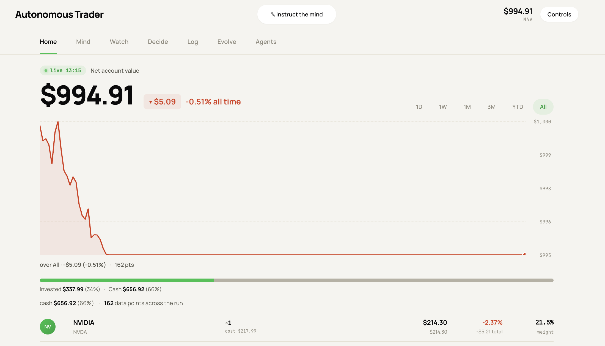
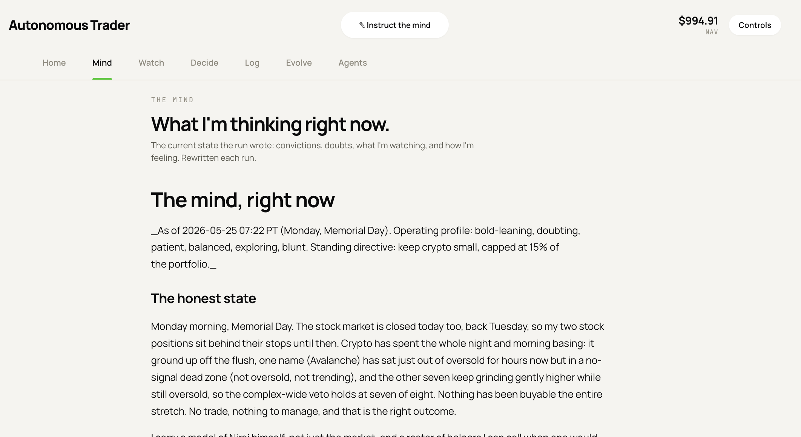
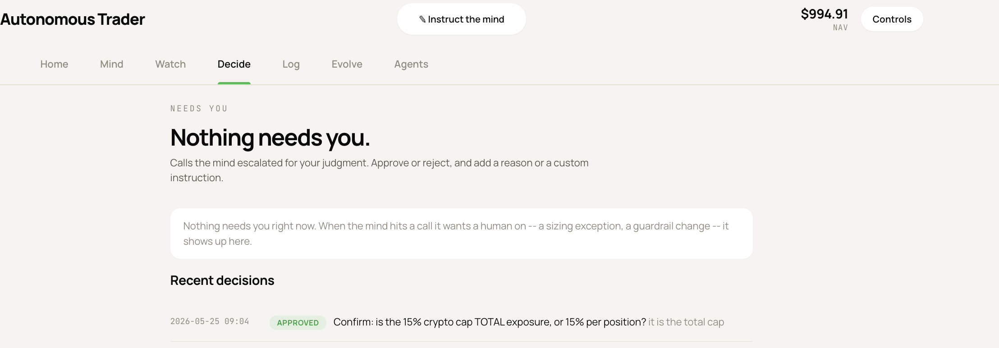
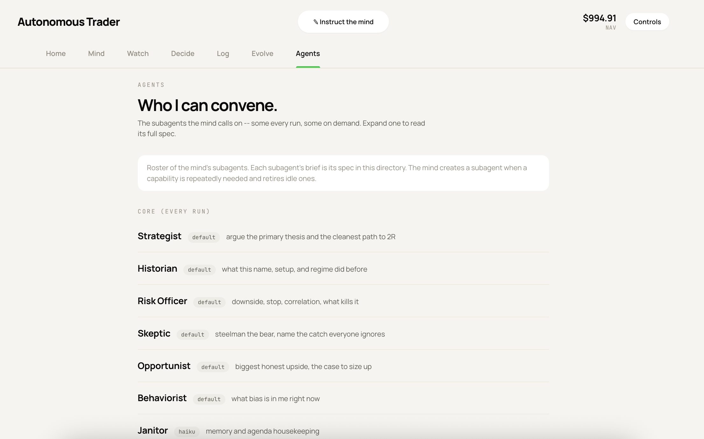

# AITrader

A Claude Code-driven trading research and autonomous trading system. Runs daily morning briefs,
tracks a personal portfolio, and operates a live autonomous trading bot on public.com — all from
a local machine with no cloud backend.

## Dashboard

A local, dependency-free dashboard renders the portfolio, the bot's live reasoning, the
decisions it routes to you for approval, and its subagent roster.

|  |  |
|:--:|:--:|
|  |  |
|  |  |

More dashboard views are in [`public_com_autonomous_trading/README.md`](public_com_autonomous_trading/README.md#dashboard).

---

## What this is

**Research feed (`/trader` skill):** each session, Claude reads live market data, scans for setups
across every instrument class (stocks, ETFs, options, LEAPs, crypto, sector rotation), and publishes
a structured brief with ranked ideas, portfolio review, and exit signals for open positions.

**Autonomous bot (`/trader-autonomous` skill, `public_com_autonomous_trading/`):** a separate
reasoning mind that runs on a loop, evaluates candidates, manages open positions, and places real
orders on a public.com cash account. It carries memory and convictions across runs, keeps an inner
monologue and a live Playbook, and maintains itself: it makes and logs its own ordinary changes
(watchlist, memory, even its own scanner logic), and escalates only control-knob and risk-guardrail
changes (caps, stops, kill-switch, arming, persona dials, your directives) to the Decisions tab,
implementing whatever you approve on its next run. It ships disarmed by default: flip `enabled: true`
in `config.json` only after reviewing dry-run cycles. Includes 24/7 crypto trading and a local
dashboard at `http://localhost:8787`. Governance lives in `SELF_MAINTENANCE.md`; Playbook upkeep in
`MIND_MAINTENANCE.md`.

---

## Prerequisites

- Python 3.9+ (`brew install python@3.11` on macOS)
- Git
- [Claude Code CLI](https://claude.ai/code) (installed and logged in)
- A [public.com](https://public.com) account (for both market data and autonomous trading)

---

## Setup

Full interactive setup is in **[SETUP.md](SETUP.md)**. Open it with a Claude Code session and
follow it top to bottom — it collects API keys one at a time, writes all gitignored files, installs
the Python venv, installs the `/trader` skill, and validates everything works.

```
# Quick start: open Claude Code in this directory and run:
/trader
```

If this is a fresh machine, tell Claude to run the setup guide first:
```
read SETUP.md and set this up for me
```

---

## API keys needed

All keys go in a gitignored `.env` file. See `.env.example` for the full list.

| Key | Required | Source |
|-----|----------|--------|
| `PUBLIC_BROKER_API` | Yes | public.com Account Settings |
| `PUBLIC_COM_ACCOUNT_ID` | Yes | public.com Account Settings |
| `FINNHUB_API_KEY` | Yes | finnhub.io (free tier) |
| `FMP_API_KEY` | Yes | financialmodelingprep.com (free tier) |
| `POLYGON_API_KEY` | Yes | polygon.io (free tier) |
| `ALPHA_VANTAGE_KEY` | Recommended | alphavantage.co (free tier) |
| `QUIVER_API_KEY` | Optional | quiverquant.com |
| `NEWSAPI_KEY` | Optional | newsapi.org (free tier) |
| `SEC_CONTACT_EMAIL` | Optional | Any valid email (used in SEC EDGAR User-Agent) |

---

## Directory map

```
CONSTITUTION.md          Hard risk rules enforced by scripts/risk.py
MISSION.md               Purpose and philosophy
knowledge/               Strategy playbooks, edges, glossary, universe definition
  strategies/            Reusable per-setup playbooks (breakout, PEAD, LEAP, etc.)
  patterns/              Observed market patterns
scripts/                 All data/analysis scripts (regime, movers, scanner, brief, etc.)
public_com_autonomous_trading/
  run_autonomous.py      Entry point; builds decision context each run
  order_client.py        The ONLY code that places orders (preflight-gated)
  guards.py              Market hours, kill-switch, sizing caps, enforced as code
  crypto_strategy.py     Codified 24/7 crypto ruleset (the scanner the mind tunes)
  approvals.py           Async approval queue; approved items implemented next run
  dashboard.py           Local dashboard (Portfolio, Activity, Decisions, Evolution, Playbook, Controls)
  SELF_MAINTENANCE.md    Governance: what the mind self-applies vs. escalates for approval
  MIND_MAINTENANCE.md    How the mind keeps the Playbook fresh and honest
  CRYPTO_RULES.md        The crypto setups, caps, and stop model
  config.json.example    Template: copy to config.json and fill in account_id + equity
state/                   (gitignored) live ledger, positions, the mind, logs, cache
.env                     (gitignored) all API keys
```

---

## Scheduling

No system cron needed. Run the research feed and autonomous bot on a loop inside your Claude Code
session:

```
/loop 1h /trader               # morning brief every hour
/loop 15m /trader-autonomous   # autonomous bot every 15 min
```

The loop survives context resets within the session. The autonomous bot runs independently and logs
every decision to `state/` and the dashboard.

---

## House rules

- `.env` and `state/` are gitignored. Nothing personal is committed.
- `order_client.py` is the only file that places orders. Nothing else touches the brokerage.
- Append-only files (`state/ledger.jsonl`, daily logs) are never rewritten — only appended.
- `config.json` is gitignored. Copy from `config.json.example`, fill in your account ID and
  starting equity. Keep `enabled: false` until you have reviewed dry-run output.
- This is a personal research tool, not financial advice.
