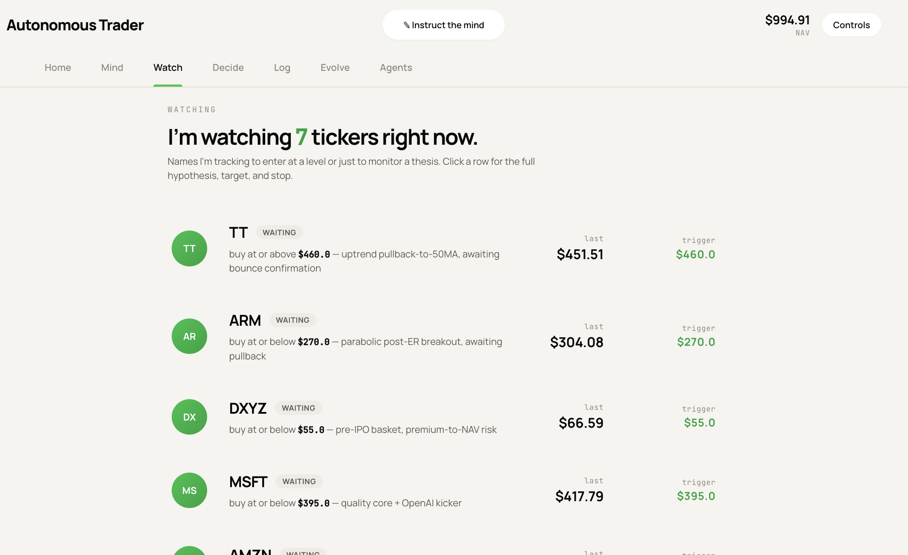
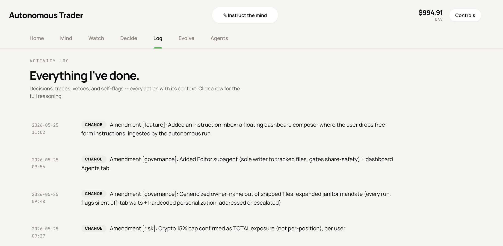
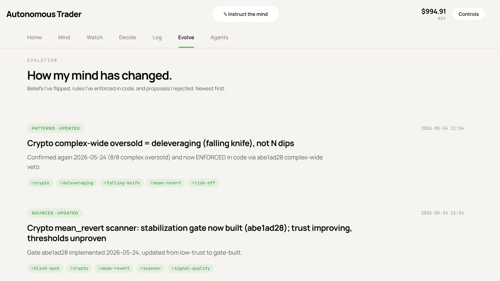
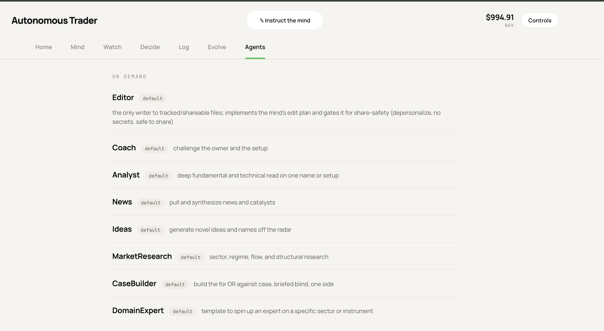
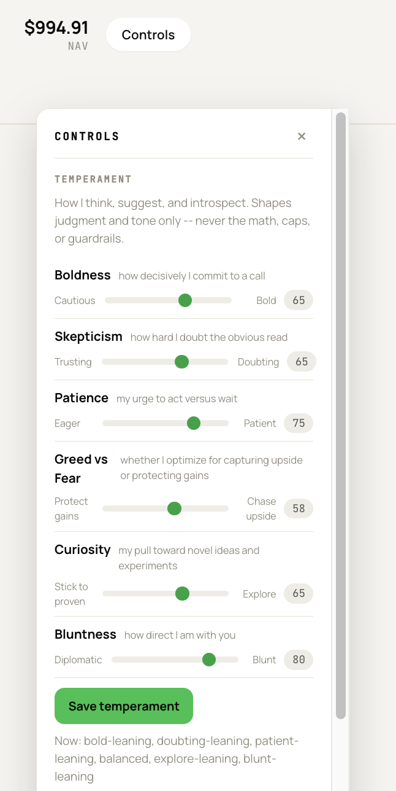

# public_com_autonomous_trading

**This is the ONLY place in the trader system where money moves.** Every script
that PLACES, MODIFIES, or CANCELS an order on public.com lives here. Anything that
only READS data (quotes, history, chains, greeks, account/positions, scans,
analysis) stays in `../scripts/` and must never call a state-changing endpoint.

If a file in this directory is run, assume it can spend real money. If a file in
`../scripts/` is run, it must be incapable of spending money.

## Hard rules for everything in this directory

1. **No sandbox exists.** Every public.com call here hits the LIVE brokerage
   account `&lt;YOUR_ACCOUNT_ID&gt;`. There is no paper mode. Treat every run as real.
2. **Preflight before placement, always.** Validate every order with the
   public.com `preflight/single-leg` or `preflight/multi-leg` endpoint (which does
   NOT place the order) and check the result before calling `place-order`. A failed
   or surprising preflight aborts the trade.
3. **Idempotency.** Every placement carries a client-generated `orderId` (UUID v4)
   so a retry can never double-submit.
4. **Determinism + logging.** Every mutating action is explicit, logged to an
   append-only trade log with timestamp, the exact request, the preflight result,
   and the response. No hidden or implicit orders.
5. **Respect the 10 req/s global rate limit** (shared with all read-only scripts;
   use the shared limiter).
6. **Kill switch.** A single config/flag must be able to disable all autonomous
   placement instantly. Default state is DISABLED until explicitly armed.

## Account / instrument constraints (enforce in code)

- **Options: Level 2 only** — single-leg options OK (long calls/puts, covered
  calls, cash-secured puts). **Spreads / multi-leg likely NOT enabled — confirm
  before ever sending a multi-leg order.**
- **No options on a restricted employer's stock.** If the operator works at a public
  company, employee policy typically bans options on that employer's stock and imposes
  blackout windows. List any such ticker(s) in your risk rules (the gitignored config),
  and check the blackout window before placing an equity order in a restricted name.
- **No stock shorting** (cash-account mechanics) — use puts / inverse ETFs.
- **Day-trading / PDT / Good-Faith-Violation guardrails** — track day-trade count
  over a rolling 5-business-day window, respect T+1 settlement, don't trade on
  unsettled funds. (Specific checks to be added from the day-trading research.)
- **Sizing + concentration caps** per the user's risk rules; never exceed without
  explicit approval.

## Read-only vs mutating (the boundary)

| Lives in `../scripts/` (read-only) | Lives HERE (mutating) |
|---|---|
| quotes, history, option chains/greeks | place-order, place-multileg-order |
| account/portfolio/positions reads | replace-order, cancel-order |
| scans, screeners, analysis, brief | preflight (paired with placement) |
| `publicdotcom_api.py` (data client) | the order-execution client + strategy runners |

## Status

Live and operating. Ships DISABLED by default (`config.json` `enabled: false` = dry-run,
logs the planned trade and places nothing); the user arms real orders by flipping that flag
after reviewing dry-run cycles. Driven on a schedule via `/trader public_api_autonomous`.

Components:

- `run_autonomous.py` builds the read-only decision context each run; `order_client.py`
  places orders (preflight-gated, refuses unless armed); `guards.py` enforces market hours,
  kill-switch, sizing/concentration caps, and a mandatory stop on every position;
  `settlement.py` tracks settled cash (GFV-proof).
- 24/7 crypto trading per `CRYPTO_RULES.md` (`crypto_strategy.py`): momentum + mean-revert
  entries, ATR-based stop floored at a max loss, 2R target, small size, software-only stops.
- Self-evolution: `reflections.py` (what is working / not), `approvals.py` (the Decisions
  queue for anything needing the user's sign-off, never blocking), `change_log.py` (applied
  rule changes + rejected registry), `risk_state.py` (versioned risk params seeded from
  config), and a Playbook (`state/playbook.md`) of convictions and tracked experiments.
- `temperament.py` is the tunable persona layer (boldness, skepticism, patience, greed/fear,
  curiosity, bluntness) the LLM adopts each run; set on the dashboard Controls tab. It shapes
  judgment and tone only, never the math or guardrails.
- `dashboard.py serve` (local, http://localhost:8787) is a server-rendered, dependency-free view
  of the mind and the book: tabs for Home (portfolio, equity curve, invested-vs-cash), Mind (the
  live mind-view), Watch (watchlist), Decide (approvals), Log (activity), Evolve (how the mind
  changed), and Agents (the subagent roster), plus a Controls overlay (temperament + accent +
  density) and an "Instruct the mind" composer that takes free-form instructions and pasted images.

See `GUARDRAILS.md` and `CRYPTO_RULES.md` for the enforced rules. Per-machine secrets and all
runtime state live under `state/` (gitignored); nothing personal is committed.

## Dashboard

`python3 dashboard.py serve --port 8787`, then open http://localhost:8787.

### Home

### Mind

### Watch

### Decide

### Log

### Evolve

### Agents

### Controls

